# Golf-Hole Plan View Art Generator Architecture Diagrams
## Implementation Details & Architecture Contemplations

**Author**: Patrick Astarita  
**Date**: November 2025  
**Purpose**: Mermaid diagrams exploring implementation details and architecture for the golf hole plan view art generator pipeline

**Related Document**: `golf-hole-plan-view-art-generator.md`

---

## 📊 Pipeline Architecture

### Data Flow Pipeline

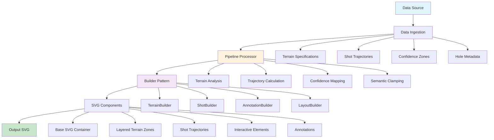

### Pipeline Processing Stages

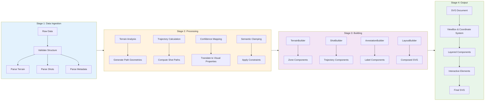

---

## 🔀 Modality Decision Architecture

### Modality Selection Decision Tree

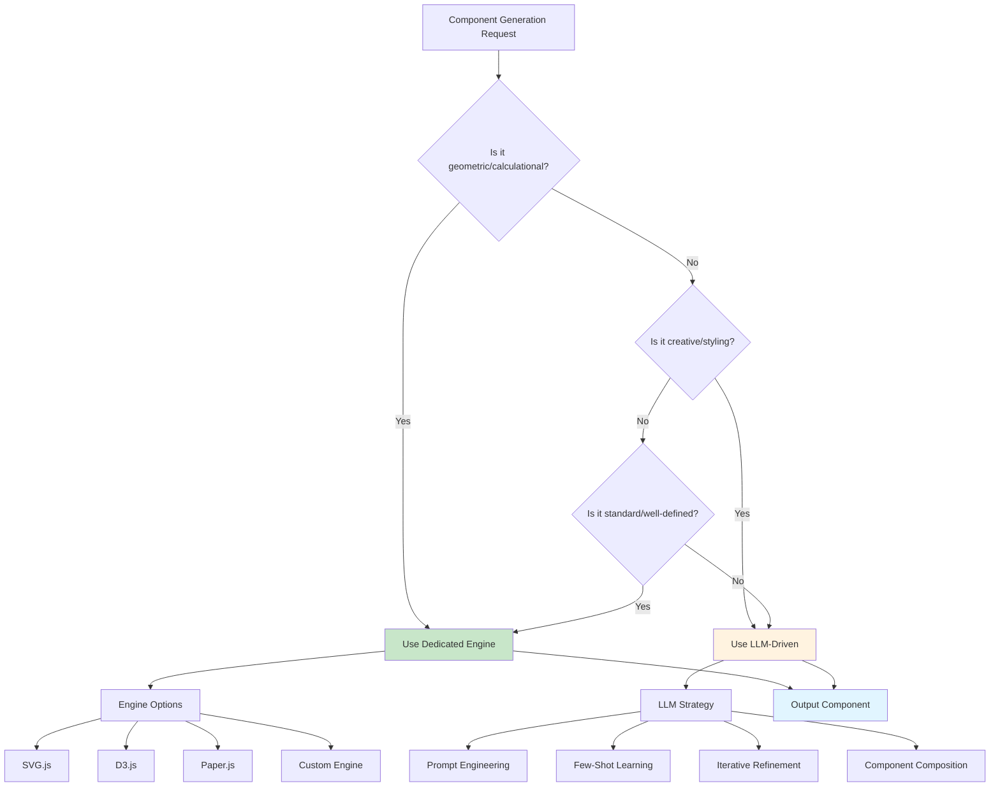

### Hybrid Modality Architecture

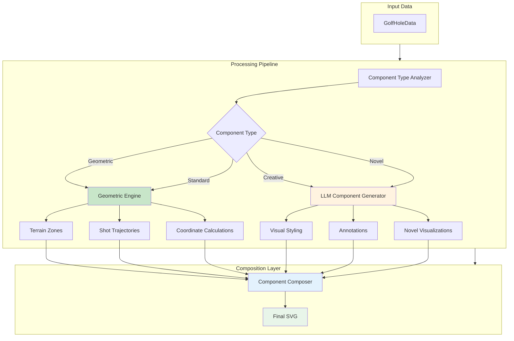

---

## 🏗️ Builder Pattern Architecture

### Builder Pattern Hierarchy

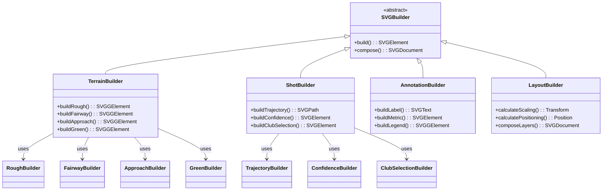

### Builder Composition Flow

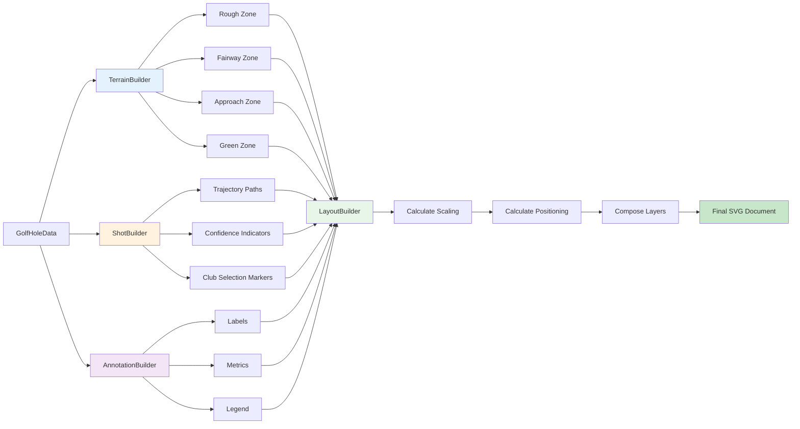

---

## 🎓 Interactive Learning Component Architecture

### Component Structure

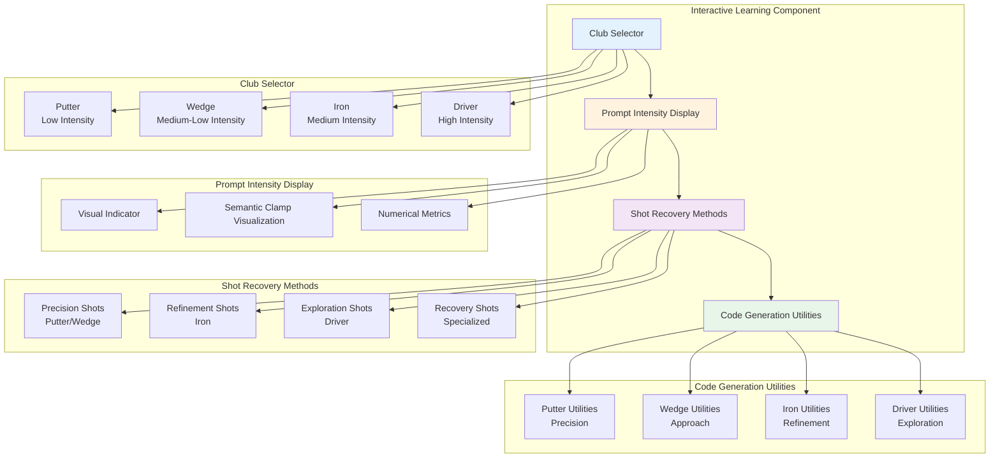

### Golf Club to Semantic Space Mapping

```mermaid
graph LR
    subgraph Golf[Golf Club]
        P[Putter<br/>Length: Short]
        W[Wedge<br/>Length: Short-Medium]
        I[Iron<br/>Length: Medium]
        D[Driver<br/>Length: Long]
    end
    
    subgraph Intensity[Prompt Intensity]
        PL[Low<br/>0.0 - 0.3]
        WL[Medium-Low<br/>0.3 - 0.5]
        IL[Medium<br/>0.5 - 0.7]
        DL[High<br/>0.7 - 1.0]
    end
    
    subgraph Clamp[Semantic Clamp]
        PC[Tight<br/>±0.1]
        WC[Moderate-Tight<br/>±0.3]
        IC[Moderate<br/>±0.5]
        DC[Loose<br/>±0.8]
    end
    
    subgraph Math[Mathematical Concept]
        PM[ε-ball Refinement<br/>B_ε(g)]
        WM[Gradient Descent<br/>Local Optimization]
        IM[Iterative Refinement<br/>Path Following]
        DM[Manifold Exploration<br/>Global Search]
    end
    
    subgraph LLM[LLM Pattern]
        PLM[Highly Constrained Prompt<br/>Specific Instructions]
        WLM[Focused Prompt<br/>Clear Constraints]
        ILM[Structured Prompt<br/>Iteration Guidelines]
        DLM[Open-ended Prompt<br/>Minimal Constraints]
    end
    
    P --> PL
    W --> WL
    I --> IL
    D --> DL
    
    PL --> PC
    WL --> WC
    IL --> IC
    DL --> DC
    
    PC --> PM
    WC --> WM
    IC --> IM
    DC --> DM
    
    PM --> PLM
    WM --> WLM
    IM --> ILM
    DM --> DLM
    
    style P fill:#c8e6c9
    style W fill:#fff3e0
    style I fill:#ffccbc
    style D fill:#ffcdd2
```

---

## 📊 Data Structures & Type System

### Core Data Models

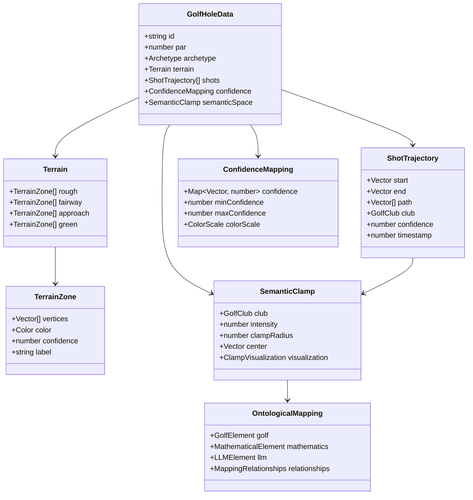

### Type Relationships

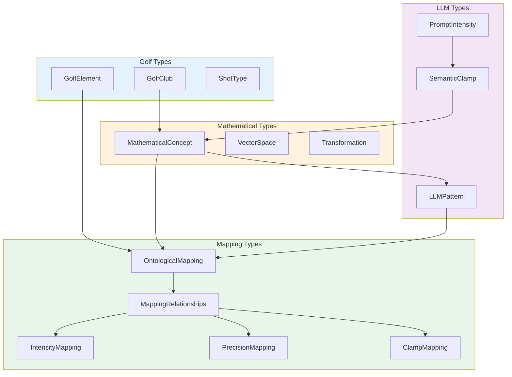

---

## 🎨 Enhanced Ontological Mapping Architecture

### SVG Layer Architecture

```mermaid
graph TB
    subgraph SVG[SVG Root Container]
        BL[Base Layer<br/>Static Elements]
        IL[Interactive Layer<br/>Clickable Elements]
        AL[Annotation Layer<br/>Tooltips & Explanations]
        ML[Mathematical Layer<br/>Notation Overlays]
        LL[Learning Layer<br/>Guided Tours]
        FL[Feedback Layer<br/>User Annotations]
    end
    
    BL --> BL1[Domain Backgrounds]
    BL --> BL2[Connection Lines]
    BL --> BL3[Labels]
    
    IL --> IL1[Clickable Elements]
    IL --> IL2[Hover States]
    IL --> IL3[Selection Highlights]
    
    AL --> AL1[Tooltips]
    AL --> AL2[Explanations]
    AL --> AL3[Examples]
    
    ML --> ML1[Notation Overlays]
    ML --> ML2[Type Definitions]
    ML --> ML3[Relationship Specifications]
    
    LL --> LL1[Guided Tour Paths]
    LL --> LL2[Progress Indicators]
    LL --> LL3[Exercise Links]
    
    FL --> FL1[User Annotations]
    FL --> FL2[Discussion Threads]
    FL --> FL3[Suggestion Overlays]
    
    style BL fill:#e3f2fd
    style IL fill:#fff3e0
    style AL fill:#f3e5f5
    style ML fill:#ffebee
    style LL fill:#e8f5e9
    style FL fill:#fce4ec
```

### Interactive Mapping Viewer Flow

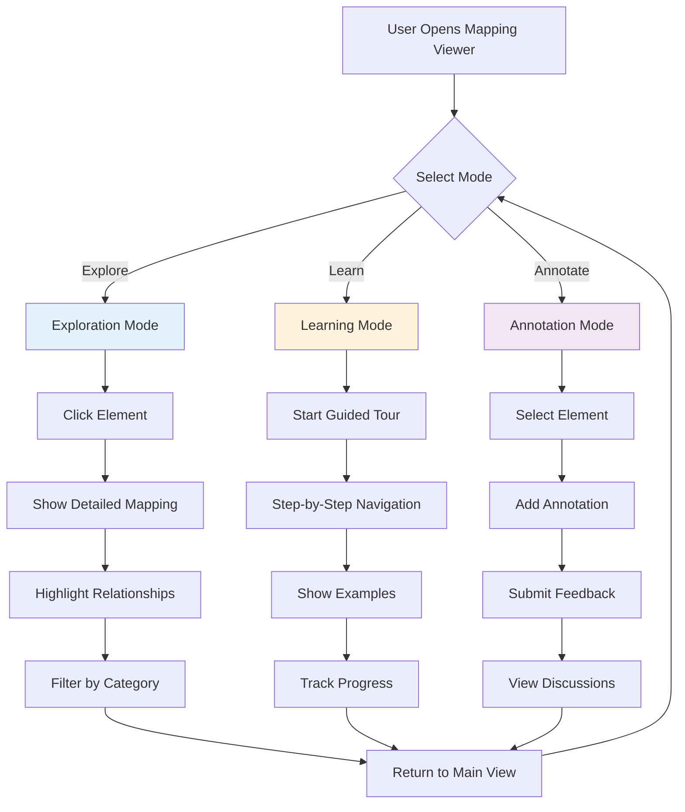

---

## 🔄 Workflow Integration

### Complete Development Workflow

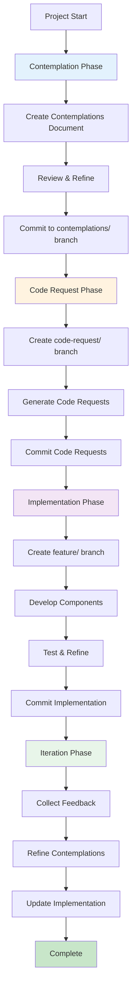

### Component Integration Flow

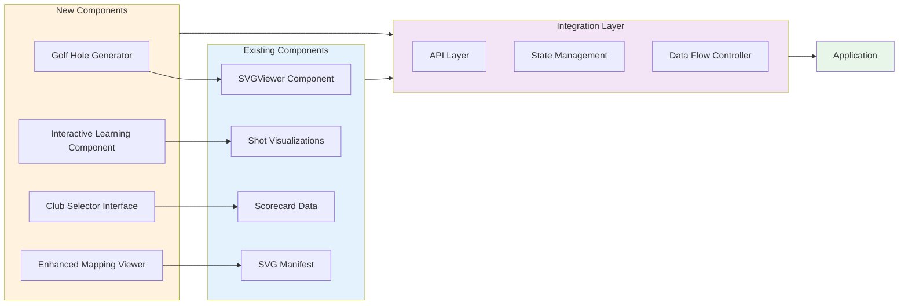

---

## 🌳 Decision Trees & Exploration Strategy

### Modality Decision Tree

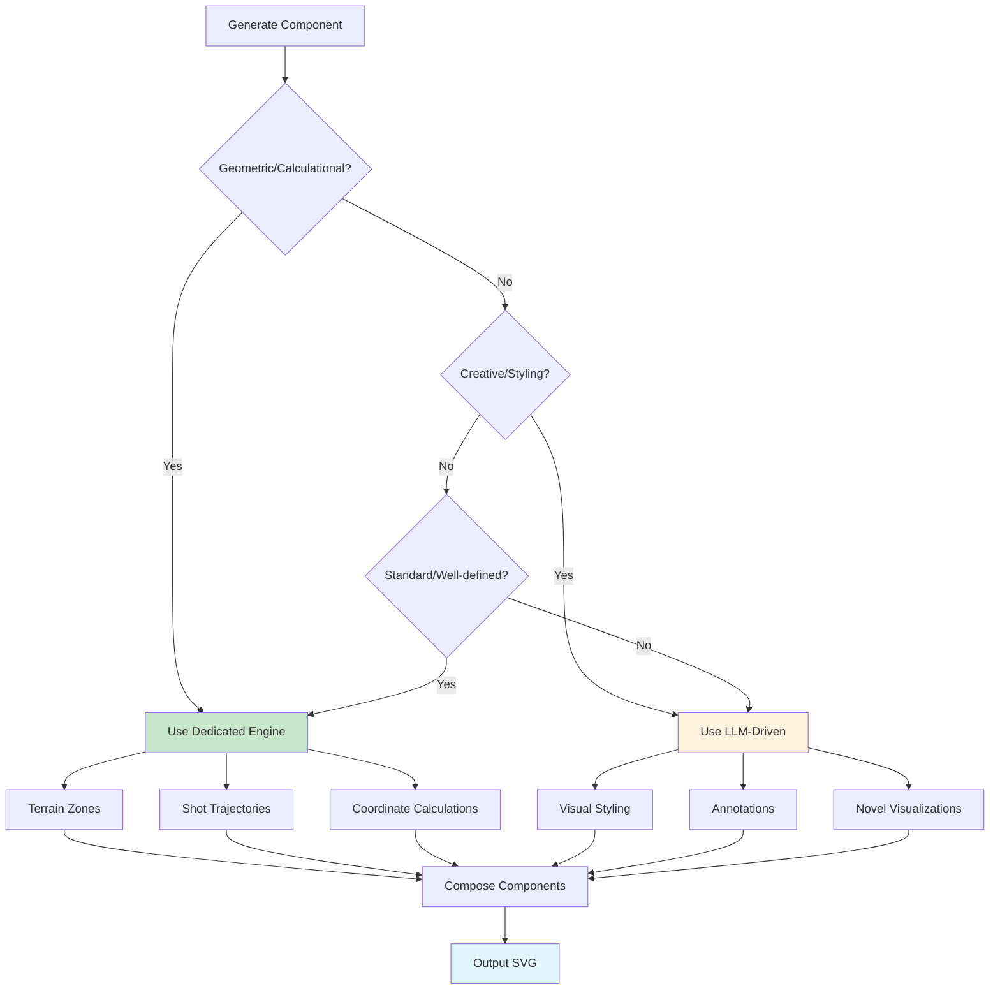

### Club Selection Learning Tree

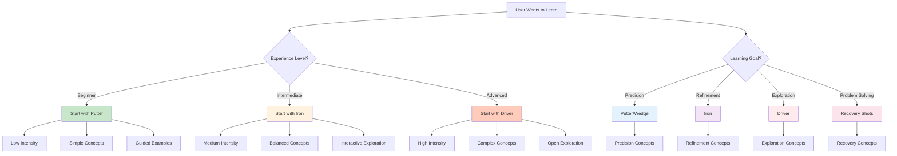

---

## 📐 API Design & Component Interfaces

### Component API Structure

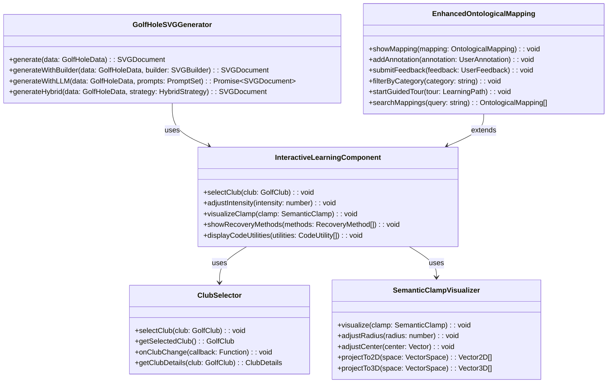

### Data Flow Through APIs

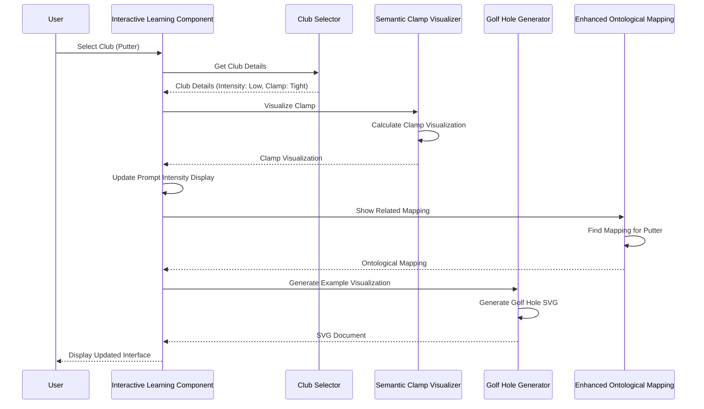

---

## 🎯 Output Types & Codification

### Output Type Relationships

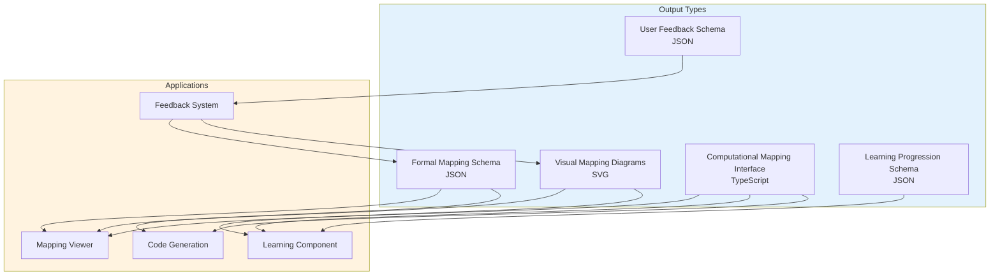

### Schema Evolution Flow

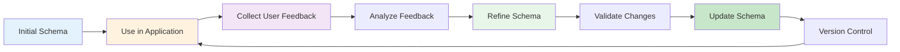

---

## 🔧 Implementation Phases

### Phase-Based Implementation Roadmap

```mermaid
gantt
    title Golf Hole Plan View Art Generator Implementation
    dateFormat  YYYY-MM-DD
    section Phase 1: Foundation
    Data Structures Design        :a1, 2025-11-01, 7d
    Core Pipeline Implementation   :a2, after a1, 10d
    Basic Builder Pattern          :a3, after a1, 10d
    section Phase 2: Enhancement
    LLM Integration                :b1, after a3, 7d
    Interactive Learning Component  :b2, after a3, 14d
    Club Selector Interface        :b3, after b2, 7d
    section Phase 3: Integration
    Enhanced Mapping Viewer        :c1, after b3, 14d
    API Integration                :c2, after b1, 7d
    State Management              :c3, after c1, 7d
    section Phase 4: Evolution
    User Feedback System           :d1, after c3, 7d
    Schema Refinement              :d2, after d1, 14d
    Performance Optimization       :d3, after c2, 7d
```

### Component Dependencies

```mermaid
graph TB
    subgraph Phase1[Phase 1: Foundation]
        DS[Data Structures]
        CP[Core Pipeline]
        BP[Builder Pattern]
    end
    
    subgraph Phase2[Phase 2: Enhancement]
        LLM[LLM Integration]
        ILC[Interactive Learning Component]
        CS[Club Selector]
    end
    
    subgraph Phase3[Phase 3: Integration]
        EMV[Enhanced Mapping Viewer]
        API[API Layer]
        SM[State Management]
    end
    
    subgraph Phase4[Phase 4: Evolution]
        UFS[User Feedback System]
        SR[Schema Refinement]
        PO[Performance Optimization]
    end
    
    DS --> CP
    CP --> BP
    BP --> LLM
    BP --> ILC
    ILC --> CS
    CS --> EMV
    LLM --> API
    EMV --> SM
    SM --> UFS
    UFS --> SR
    API --> PO
    
    style Phase1 fill:#e3f2fd
    style Phase2 fill:#fff3e0
    style Phase3 fill:#f3e5f5
    style Phase4 fill:#e8f5e9
```

---

## 📚 Summary

This architecture document provides comprehensive Mermaid diagrams exploring:

1. **Pipeline Architecture**: Data flow from ingestion through processing to SVG output
2. **Modality Decisions**: When to use dedicated engine vs LLM-driven approaches
3. **Builder Pattern**: Hierarchical structure for component composition
4. **Interactive Learning**: Component architecture for golf club analogy
5. **Data Structures**: Type system and relationships
6. **Enhanced Mapping**: SVG layer architecture and interaction flows
7. **Workflow Integration**: Development workflow and component integration
8. **Decision Trees**: Exploration strategies and learning paths
9. **API Design**: Component interfaces and data flows
10. **Output Types**: Schema relationships and evolution
11. **Implementation Phases**: Roadmap and dependencies

All diagrams support the contemplations document and provide visual guidance for implementation decisions.

---

**End of Architecture Diagrams Document**

