# Prompt Classifier Extension - Visual Diagrams

**Architecture, flows, and system diagrams**

---

## 1. System Architecture Overview

---

## 2. Classification Flow

---

## 3. Feature Extraction Pipeline

---

## 4. Archetype Classification Decision Tree

```mermaid
graph TD
    A[Prompt Features] --> B{Has Line Number?}
    B -->|Yes| C{Word Count < 15?}
    C -->|Yes| D[⊕ PRECISION]
    
    B -->|No| E{Has Question?}
    E -->|Yes| F{Has Research Keywords?}
    F -->|Yes| G[⊛ EXPLORER]
    
    E -->|No| H{Has Design/UX Keywords?}
    H -->|Yes| I{Has Constraints?}
    I -->|No| J[⊜ CREATIVE]
    
    H -->|No| K{Has Implementation Keywords?}
    K -->|Yes| L[⊗ CONVERGENT]
    
    C -->|No| M[Score All Archetypes]
    F -->|No| M
    I -->|Yes| M
    K -->|No| M
    
    M --> N[Select Highest Score]
    
    style D fill:#9c27b0,color:#fff
    style G fill:#ff9800,color:#fff
    style J fill:#e91e63,color:#fff
    style L fill:#2196f3,color:#fff
```

---

## 5. Shot Type Classification

```mermaid
graph LR
    A[Calculate Confidence] --> B{Confidence Score}
    
    B -->|< 0.6| C[● DRIVER<br/>Exploratory]
    B -->|0.6-0.8| D[◐ IRON<br/>Refinement]
    B -->|0.8-0.95| E[◑ WEDGE<br/>Precision]
    B -->|> 0.95| F[○ PUTTER<br/>Polish]
    
    A --> G{Has Recovery Indicators?}
    G -->|Yes| H[↺ RECOVERY<br/>Fix Mistakes]
    
    style C fill:#1a5f7a,color:#fff
    style D fill:#2d5016,color:#fff
    style E fill:#b8860b,color:#fff
    style F fill:#cc5500,color:#fff
    style H fill:#666,color:#fff
```

---

## 6. Quality Metrics Calculation

---

## 7. User Interaction Flow

---

## 8. Session Analytics Flow

---

## 9. Data Flow Diagram

---

## 10. Development Phase Timeline

---

## 11. Component Dependency Graph

---

## 12. Classification Matrix

```mermaid
graph TB
    subgraph "Archetype × Shot Type Matrix"
        A[⊕ Precision] -.-> A1[● Driver: Quick question]
        A -.-> A2[◐ Iron: Targeted fix]
        A -.-> A3[◑ Wedge: Specific change]
        A -.-> A4[○ Putter: Tiny tweak]
        
        B[⊗ Convergent] -.-> B1[● Driver: Broad feature idea]
        B -.-> B2[◐ Iron: Implementation with spec]
        B -.-> B3[◑ Wedge: Refinement details]
        B -.-> B4[○ Putter: Final polish]
        
        C[⊛ Explorer] -.-> C1[● Driver: Open research]
        C -.-> C2[◐ Iron: Narrowed options]
        C -.-> C3[◑ Wedge: Specific exploration]
        C -.-> C4[○ Putter: Final verification]
        
        D[⊜ Creative] -.-> D1[● Driver: Initial concept]
        D -.-> D2[◐ Iron: Design direction]
        D -.-> D3[◑ Wedge: Visual refinement]
        D -.-> D4[○ Putter: Aesthetic polish]
    end
    
    style A fill:#9c27b0,color:#fff
    style B fill:#2196f3,color:#fff
    style C fill:#ff9800,color:#fff
    style D fill:#e91e63,color:#fff
```

---

## 13. Performance Optimization Strategy

---

## 14. Storage Architecture

---

## 15. Error Handling Flow

---

## 16. Team Sharing Flow

---

## 17. Integration with Golf Scorecard

---

## 18. ML Model Pipeline (Phase 3)

---

## Legend

### Colors
- 🔵 **Blue**: Core components
- 🟢 **Green**: Success states
- 🟡 **Yellow**: Storage/data
- 🔴 **Red**: Error states
- 🟠 **Orange**: Warning states
- 🟣 **Purple**: User interface

### Shapes
- **Rectangle**: Process/Component
- **Diamond**: Decision point
- **Circle**: Start/End point
- **Cylinder**: Data storage
- **Parallelogram**: Input/Output

---

**Diagram Version**: 1.0.0  
**Last Updated**: November 4, 2025  
**Status**: Complete

*These diagrams are generated using Mermaid and can be rendered in any Markdown viewer that supports Mermaid syntax.*

